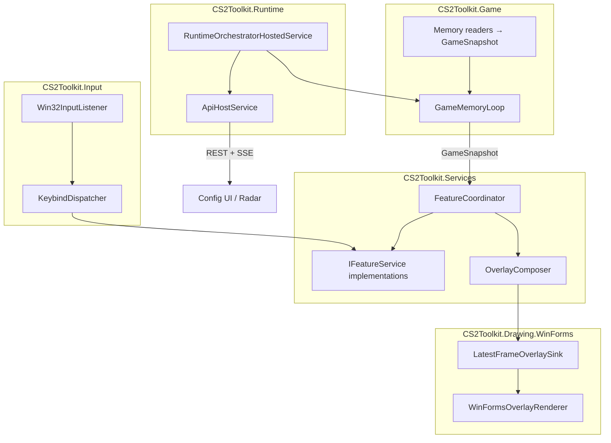

# CS2 Toolkit

External Counter-Strike 2 toolkit rebuilt as a layered .NET 9 solution. The original monolith is preserved in [`_old/`](_old/) for reference only and is **not** part of the v2 build.

## Status

v2 feature migration, API/config UI, and runtime orchestration are complete. See **[ROADMAP.md](ROADMAP.md)** for the full checklist and **[docs/PARITY.md](docs/PARITY.md)** for manual validation.

## Requirements

- .NET 9 SDK
- Windows Desktop runtime (`net9.0-windows`) — WinForms overlay and Win32 input
- Node.js 20+ (frontend is built automatically during `dotnet build`)

## Build and run

```bash
dotnet build CS2Toolkit.slnx
bash scripts/dependency-guard.sh
dotnet run --project src/CS2Toolkit.Runtime/CS2Toolkit.Runtime.csproj
```

On startup:

1. Offsets download (fatal if unavailable)
2. Overlay renderer and map collision preload
3. Config UI opens at `http://localhost:8080` (or next free port)
4. Press **F9** (inject key) when CS2 is running to attach
5. Game loop and features start after attach

Default hotkeys (editable in config UI / profile store):

| Key | Action |
|-----|--------|
| F9 | Attach to CS2 |
| F10 | Panic shutdown |
| F11 | Save runtime toggles to active profile |
| F4–F8 | Feature toggles (aim helper, sound ESP, enemy ESP, triggerbot, RCS) |
| Insert | In-game menu overlay |

Configuration profiles live in `data/configs/store.json`. Host-only settings (poll interval, offset URLs, map cache paths) are in `appsettings.json` under `Toolkit`.

## Repository layout

```
CS2Toolkit.slnx
ROADMAP.md
src/
├── CS2Toolkit.Models[.Abstractions]/
├── CS2Toolkit.Configuration[.Abstractions]/
├── CS2Toolkit.Input[.Abstractions]/
├── CS2Toolkit.Game[.Abstractions]/
├── CS2Toolkit.Drawing[.Abstractions]/ + Drawing.WinForms/
├── CS2Toolkit.Services[.Abstractions]/
├── CS2Toolkit.API[.Abstractions]/
├── CS2Toolkit.Runtime[.Abstractions]/
├── CS2Toolkit.Frontend/          # React config UI → wwwroot/
docs/                             # Class docs, ADRs, contributor guide
scripts/dependency-guard.sh
_old/                             # Legacy reference (not in solution)
```

## Architecture



### Layer rules

| Rule | Detail |
|------|--------|
| Services → Game/Input implementations | **Forbidden** — abstractions only |
| API → Services implementation | **Forbidden** — `Services.Abstractions` only |
| Pipeline → WinForms/GDI+ | **Forbidden** on hot path |
| Runtime | **Only** project referencing all implementations |

Hot path per tick: **read memory → map snapshot → feature services (combat/input) → compose overlay → publish frame**. Rendering consumes the latest `OverlayFrame` on a separate UI thread and may drop frames.

## Documentation

- [docs/README.md](docs/README.md) — class documentation index
- [docs/ADDING_A_FEATURE.md](docs/ADDING_A_FEATURE.md) — how to add a feature service
- [docs/adr/](docs/adr/) — architecture decision records
- [docs/PARITY.md](docs/PARITY.md) — v2 vs legacy validation checklist

## Legacy comparison

To build the old monolith for side-by-side comparison:

```bash
cd _old && dotnet build
```
